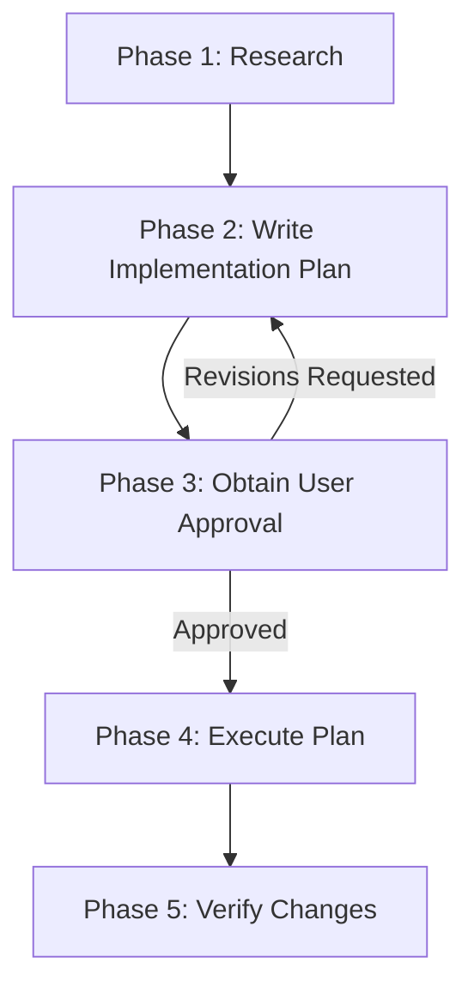

# Agent Implementation Planning Workflow

## Purpose

This skill defines the **mandatory planning workflow** for non-trivial changes across
software projects. It ensures complex work is researched, documented, user-approved, and
verified -- preventing wasted effort, uncoordinated subagents, and unintended breaking
changes.

> [!IMPORTANT]
> **Precedence Clause**: A project's own planning skill, `AGENTS.md`, or `CLAUDE.md`
> overrides this baseline wherever they differ. This skill provides the core methodology
> and baseline conventions for repositories that do not specify an overriding policy.

**Related skills**: `agent-subagent-guidelines` for the mandatory Subagent Use section.
Your harness's own skill for how it reconciles its plan mode or artifact directory with
the plans repository.

---

## When a Plan Is Required

A written implementation plan is **required** when a task meets **any** of these criteria:

- It touches **more than one file**, component, or subsystem
- It crosses a **build or code regeneration boundary** (database migrations, parser
  generators, client SPA rebuilds, stylesheet compilers)
- It modifies public APIs, interfaces, interop contracts, or database schemas
- It is a refactor, architectural change, new feature, or anything described as
  non-trivial

A plan is **not** required for:

- Single-file bug fixes or localized tweaks
- Typo and comment corrections
- Answering questions or read-only investigation
- Minor follow-ups while executing an already-approved plan

**When in doubt, write a plan.** A rejected plan is cheap; wrong cross-system work is
expensive.

---

## The Five-Phase Lifecycle



### Phase 1 -- Research

- Use search and file-reading tools to understand affected code, dependencies, and
  implications.
- **Do NOT modify any files during this phase.** Read-only operations only.
- **Do NOT read documents from the plans repository or from any `.plans/`** (see Plans
  Isolation During Research).

### Phase 2 -- Write the Implementation Plan

- Create the plan as a Markdown file in the plans repository (see Where to Save Plans).
- Address open questions and design decisions directly in the plan.
- If your harness confines you to a private plan file or artifact directory, copy the
  finished document to the plans repository **before** requesting approval.

### Phase 3 -- Obtain User Approval

- **STOP and wait for explicit user approval before editing any project file.**
- Always print the plan's file path so the user can review it.
- Use the harness's approval mechanism where one exists; otherwise print a concise
  summary and wait. **Approval is never skipped.**

### Phase 4 -- Execute

- Implement step-by-step, tracking progress in `task.md`.
- If you discover something requiring significant deviation, pause, update the plan, and
  request approval for the revision before continuing.

### Phase 5 -- Verify

- Run tests, builds, and linters; complete the manual checks.
- Create `walkthrough.md` summarizing what changed, what was tested, and the results.

---

## Write for a Context-Free Implementer

**The person or agent implementing your plan may have none of your context, and may be a
different model in a different application.** Plans are handed between harnesses through
the plans repository, and the implementing session cannot ask the planning session
anything.

- No "as discussed above" across documents; no reliance on session history.
- Every file path absolute or repository-relative.
- Every decision stated, not implied. If you considered and rejected an approach, say so,
  or someone will re-propose it.
- Name the exact command, not "run the migration".

This is why plan quality is load-bearing: a well-specified plan makes most
implementation straightforward, and an underspecified one silently becomes guesswork.

---

## Plan Document Structure

```markdown
# [Goal Description]

Brief summary of the problem, background context, and objectives.

## User Review Required                          <- if applicable
Decisions the user must make (breaking changes, tradeoffs, data loss risk).

## Open Questions                                <- if applicable
Clarifying questions that impact implementation details.

## Execution Target                              <- optional
Planned in: <harness> (<tier>)
Intended implementer: <harness> (<tier>)

## Document Set                                  <- if more than one versioned document
| Document | Version |
|----------|---------|
| `implementation_plan_v3.md` | v3 |
| `client_implementation_plan_v3.md` | v3 (unchanged from v2) |

## Affected Files                                <- mandatory
| File | Component / Area | Change |
|------|------------------|--------|
| `path/to/FileA.cs` | Backend | Add method `DoThing()` |

## Build Impact                                  <- mandatory
Regeneration boundaries triggered (migrations, stylesheet compilation, client
build, code generation), or "None".

## Proposed Changes                              <- mandatory
Grouped by component, ordered by dependency (prerequisites first).
Mark each file [NEW], [MODIFY], or [DELETE].

## Subagent Use                                  <- mandatory
### Subagents Needed
[Yes / No -- if no, explain why]

### Subagent Assignments
| Task | Tier | Files | Rationale |

### Human Assignments (if any)
| Task | Rationale | Fallback if Not Approved |

## Risks                                         <- mandatory
What could break, edge cases, and mitigation strategies.

## Verification Plan                             <- mandatory
### Automated
- Test / build / linter commands.
### Manual
- Steps to verify functional correctness.
```

### The Execution Target line

Optional, but when the plan will be implemented in a different application than it was
written in, it calibrates everything else:

```markdown
## Execution Target
Planned in: Claude Code (deep)
Intended implementer: Antigravity (standard)
```

It names a **harness and a tier, never a model version** -- the planning session cannot
verify the implementing application's model roster, and **no agent can perform the
handoff**. A person opens the other application; the plan document is the entire
interface.

### Key structural rules

1. **Affected Files** -- every file the plan touches must be listed.
1a. **Document Set** -- required whenever the task directory holds more than one versioned
   document. Omit it for a lone plan. See Version harmonization.
2. **Build Impact** -- explicitly state which regeneration steps must be re-run, or
   "None".
3. **Subagent Use** -- mandatory even when the answer is "No" (state why).
4. **Risks** -- do not skip. Even "low risk" changes should state what to watch for.
5. **Proposed Changes** -- order by dependency. Regeneration boundaries fall **between**
   steps, never inside one.

### Scaling the format

The full format applies to **non-trivial** work. If a harness asks for "concise" plans,
that means *no excessive verbosity within this format* -- keep every mandatory section
but keep each one tight. Never trim the Affected Files table.

For **truly trivial** work the harness's own concise format (or no plan) is acceptable.
Say in chat that the shortcut was taken because the task was trivial. If the user then
asks for the full format, produce it as the next revision.

---

## Where to Save Plans and Other Documents

All AI-produced documents -- implementation plans, reviews, analyses, bug reports, and
other structured artifacts -- are saved in the **shared `plans` repository**, not inside
the repository you are working on.

### What may be stored in the plans repository

**Only plans for repositories in an allowed GitHub organization.** Work that belongs to no
repository is never stored here, however useful it is.

| Allowed organization | Why |
|----------------------|-----|
| `hyvanmielenpelit` | Our own repositories |
| `dotnet` | Upstream .NET work, usually via a fork |
| `mono` | Upstream Mono work, usually via a fork |

Every repository inside those organizations qualifies; nothing outside them does. To change
this list, see `docs/plans-repository-allowlist.md` in the `SharedAgentSkills` repository --
it names every file that has to change together.

**Decide the tier before writing anything, and say which one applies when you deliver the
plan.** A reader cannot otherwise tell whether a plan is shared, local, or ephemeral.

| Tier | Where | When |
|------|-------|------|
| **1. Plans repository** | `<plans-root>/<organization>/<repository>/YYYY-MM-DD/task_name/` | The work is about one or more repositories in an allowed organization, and the root resolves |
| **2. Gitignored `.plans/`** | `<repository-root>/.plans/YYYY-MM-DD/task_name/` | Tier 1 does not apply, **and** Git confirms `.plans/` is ignored in that repository |
| **3. Chat only** | Nowhere on disk | Neither of the above. Write the plan into the conversation and create no file |

#### Determining the organization

Read it from the remote; do not infer it from the folder name, which proves nothing --
clones get renamed, and the scope must match the GitHub path it claims:

```powershell
git -C <repository> remote get-url origin
```

The organization is the path segment before the repository name.

- **Forks.** If `origin` is not in an allowed organization but an `upstream` remote is, use
  **`upstream`** for the scope. That is where the work is destined, and it is the normal
  shape of contributing to `dotnet` or `mono`.
- **No remote at all** -- a local-only repository -- is not eligible for tier 1. There is
  no GitHub path to mirror.

#### The `.plans/` precondition

> [!CAUTION]
> **Never create a `.plans/` directory that the repository would commit.** In our own
> repositories `.plans/` is already ignored and tier 2 is available. In an upstream
> repository such as `dotnet/runtime` it is **not** ignored, and writing there puts
> agent-generated documents into the working tree of a repository you are preparing a pull
> request from -- one `git add -A` from the PR.

Ask Git, not the file. The answer can come from a nested `.gitignore`, `.git/info/exclude`,
or the global excludes file, and only Git knows all three:

```powershell
git -C <repository> check-ignore -q .plans
```

Exit code `0` means ignored: tier 2 is available. Exit `1` means **not** ignored: go to
tier 3. **Do not add `.plans/` to that repository's `.gitignore`** -- that is a change to
someone else's repository, made for your own convenience.

#### Tier 3 in practice

Tier 3 restricts **storage, not process**. The plan is still written in full, still follows
the mandatory format, and still requires approval before any file is edited. What changes:

- No plan file, no `task.md`, no `walkthrough.md`.
- Track progress with the harness's own todo mechanism instead of `task.md`.
- **The plan does not survive the session.** Say so when you deliver it -- the user may
  want to keep a copy themselves.

---

### Resolving the plans root

In this order:

1. **`AGENT_PLANS_ROOT`**, if set and pointing at an existing directory.
2. **`C:\hmp\plans`**, the standard location on these machines. Naming it directly means
   the common case resolves without depending on where the current repository sits.
3. **`<repository-root>/../plans`** -- a `plans` directory beside the repository you are
   working on. This covers a developer who checks out somewhere other than `C:\hmp`.
4. **Nothing resolves, or the directory is not writable:** use the fallback below.

Each candidate must be **both** present **and** a Git working tree. A bare directory named
`plans` is a symptom, not a store; test with `git -C <candidate> rev-parse --git-dir` and
move to the next rule if it fails.

> [!IMPORTANT]
> **Never create the plans root yourself.** A directory you create is not a clone: it has
> no remote, nothing is ever pushed from it, and it silently becomes a second divergent
> store that looks perfectly healthy. An absent root is a setup problem for the user to
> fix -- say so, and use the fallback until they do.

### Layout

```text
<plans-root>/
  <organization>/
    <repository>/
      YYYY-MM-DD/
        task_name/
          implementation_plan_v<N>.md       <- N=1 for the first version
          code_review_v<N>.md               <- example: a review document
          bug_analysis_v<N>.md              <- example: an analysis document
          task.md                           <- single file, from the approved plan
          walkthrough.md                    <- single file, post-completion summary
          implementation_review_A_v<N>.md   <- follow-up round A
          task_A.md                         <- follow-up A checklist
          walkthrough_A.md                  <- follow-up A walkthrough
```

### Choosing the scope

The scope mirrors the GitHub path, so a directory maps one-to-one onto a URL:
`hyvanmielenpelit/GnollHack/` is `github.com/hyvanmielenpelit/GnollHack`.

| Situation | Scope |
|-----------|-------|
| One repository | `<organization>/<repository>`, both spelled exactly as on GitHub. The local folder name is not authoritative; the GitHub path is |
| Several, one clearly main | The main repository's scope. State in the plan's opening paragraph which others are touched and why this one was chosen |
| Several in one organization, none main | Repository names joined with `_` in **alphabetical order**: `hyvanmielenpelit/GnollHack_MobileGnollHackLogger` |
| Several spanning organizations, none main | The organization/repository **where the work primarily lands** -- the working tree you actually edit |
| Any repository outside an allowed organization | **Not tier 1.** Use tier 2 or 3, regardless of how the work looks |
| No repository at all | **Not stored here.** Use tier 2 or 3 |

The plans repository is **not** a special case: plans about it go to
`hyvanmielenpelit/plans/`, its ordinary location.

**Every top-level directory in the plans repository is a GitHub organization name.** There
is no committed scope for anything else -- that is what restricting the store to allowed
repositories means.

| Prefix | Committed | Meaning | Example |
|--------|-----------|---------|---------|
| *(none)* | yes | A GitHub organization or user; repositories live one level below | `hyvanmielenpelit/` |
| `.` | **no** | A local-only working area, ignored automatically | `.local/` |

The global "never write scratch into a repository" rule still applies here -- the `.`
convention is for personal drafts, not for scratch scripts.

### Directory naming

- **Date directory** (`YYYY-MM-DD`): the creation date of the **first** document for the
  task. Follow-ups on later dates reuse the same directory.
- **Task directory**: a short, descriptive `snake_case` name.
- **Create subdirectories** as needed -- they will not exist the first time.
- **Conflict resolution**: if the desired task directory already exists under the same
  scope **and** date, find the next free name in the sequence `task_name`, `task_name_2`,
  `task_name_3`, ... Always increment from the **base** name; never nest suffixes
  (`task_name_2_3` is wrong). Never rename the existing folder, and do not read or modify
  it. When both locations are readable, check both before choosing a name.

### Finding an existing task

When picking up work someone else planned, look in the **plans repository first**, then
the working repository's `.plans/`. A document may legitimately be in either, and a
fallback document says so in its own header.

### Line endings

Documents in the plans repository are written **CRLF**, as in every repository here.
`core.autocrlf` is `false` on these machines, so Git will not correct a wrong guess. See
`agent-powershell-guidelines`.

> [!IMPORTANT]
> **No secrets.** The plans repository is private but **shared**, and agents push to it
> without waiting for a human. No credentials, API keys, connection strings, tokens,
> production hostnames, or personal data may appear in any document. This is a behavioural
> change from the old `.plans/`, which never left the machine, and it is the most likely
> way this arrangement causes harm. The rule applies to fallback documents too: they are
> written locally, but they are written to be moved.

> [!IMPORTANT]
> **Three distinct suffix types -- do not confuse them:**
>
> | Suffix | Applies to | Meaning | Example |
> |--------|-----------|---------|---------|
> | `_2`, `_3`, ... | **Folder** names | Conflict resolution for separate tasks with the same name | `game_page_update_2/` |
> | `_A`, `_B`, ... | **File** names | Follow-up round within the same task folder | `implementation_review_A_v1.md` |
> | `_v1`, `_v2`, ... | **File** names | Document revision (never overwrite, always increment) | `implementation_plan_v2.md` |

### Document versioning (STRICT)

Applies to **all** document types:

1. **First version** always gets `_v1`.
2. **Never overwrite an existing version.** To revise, create a new file with the next
   number (read `_v1` -> write `_v2`).
3. **Determine the next version** by checking which files already exist.
4. **Do not delete or modify** older versions. They are the revision history that lets a
   user compare approaches across different agents and sessions.

**Exception -- `task.md` and `walkthrough.md`** are **singular** (no version suffix),
based on whichever plan version was ultimately approved. The walkthrough must state which
plan version was implemented. Follow-up rounds get lettered variants (`task_A.md`,
`walkthrough_A.md`).

### Version harmonization across a document set

When one task directory holds several versioned documents describing **one coherent piece
of work** -- a main plan plus per-repository sub-plans, or a plan plus the analysis it
depends on -- they form a **document set**, and every member carries the **same version
number**.

Revising any member bumps **all** members to the next `_v<N>`, **including members with no
content changes**. An unchanged member is copied verbatim to the new version number. Yes,
this means writing a file whose only difference from its predecessor is its name. That is
the intended cost.

- **Mixed versions inside a set are a defect.** `implementation_plan_v3.md` sitting beside
  `client_implementation_plan_v2.md` leaves a reader unable to tell whether the v2 was
  reviewed against the v3 or is simply stale. There is no way to recover the answer later.
- The **main document declares the set** in a `## Document Set` section listing every
  member at the current version.
- A carried-forward member may add **exactly one line** directly under its title:
  `> Unchanged from _v2; version harmonized with implementation_plan_v3.md.` Nothing else
  in it changes.
- Harmonization is scoped to **one task directory and one follow-up round**. `task.md` and
  `walkthrough.md` stay singular and are not set members.
- A document that is genuinely **independent** -- an unrelated bug analysis, say -- is not
  a set member and versions on its own. If you are unsure whether it is independent, it is
  not: put it in the set.
- **A set is never split across locations.** If the fallback is in play, the whole set is
  written to `.plans/`, including members that would otherwise have been unchanged copies.

---

## Committing in the Plans Repository

> [!CAUTION]
> **The `plans` repository is the ONLY repository in which you may run `git commit` or
> `git push`.**
>
> In **every** other repository -- every project repository, the skills repository, and
> any repository added later -- **committing and pushing are forbidden.** Write the files,
> leave them modified or untracked, and print the commands for a person to run. This holds
> even when the change is finished, tested, obviously correct, and the user approved the
> plan that produced it: **approving a plan is not permission to commit its result.**
>
> **Four things that are not exceptions:**
>
> 1. **The `.plans/` fallback.** A fallback document is written *inside a project
>    repository*, so the prohibition applies to it. `.plans/` is gitignored, so there is
>    nothing to commit -- and if that tempts you toward `git add -f`, stop.
> 2. **Subagents.** No subagent commits anything, anywhere, including in `plans`. The
>    orchestrator owns the round and makes its single commit.
> 3. **A tidy working tree.** Leaving files uncommitted is the intended end state, not an
>    unfinished one.
> 4. **The plans repository before its first push.** Until the repository exists on the
>    remote and a person has made the initial commit, this protocol is dormant: write
>    documents, leave them untracked, say so.
>
> **Before every `git commit` or `git push`, verify the target.** The `-C` path, or the
> current directory, must resolve to the plans repository. If it does not, do not run the
> command. A commit aimed at the wrong repository is a rule violation regardless of what it
> contains, and it can sweep up the user's uncommitted work alongside yours.

Within the plans repository, commit and push **without being asked**. The reason is
specific to this store:

> Documents here are **append-only**. A revision is a new `_v<N>` file, never an edit to an
> existing one, so there is no window in which a written document is still changing, and
> nothing is waiting to be reviewed between writing and committing. Holding the commit back
> would only delay the moment another developer can see the plan.

### When

**Once per round, at the end** -- after **every** document of that round exists. Never file
by file.

| Round | Commit when |
|-------|-------------|
| Planning | The whole plan set is written (main plan, sub-plans, harmonized members), before requesting approval |
| Revision | The whole set has been bumped to `_v<N>` |
| Completion | `task.md` is final **and** `walkthrough.md` is written |

Do **not** commit after each checkbox in `task.md`. It is committed once, with the
walkthrough, at the end of the round.

### How

```powershell
git -C <plans-root> pull --rebase --autostash
git -C <plans-root> add <the exact paths you wrote>
git -C <plans-root> commit -m "<scope>: <what the document is> for <task_name>"
git -C <plans-root> push
```

- **Stage explicit paths. Never `git add .` or `git add -A`.** The clone is shared: a
  blanket add publishes another developer's or another session's unfinished draft alongside
  yours.
- **Commit only files you wrote in this session.**
- **Never rewrite history** -- no `--amend`, no `--force`, no editing a pushed version.
  Published versions are the revision history.
- **A rejected push and a failed push are different failures.** Do not treat them alike:

  | Symptom | Meaning | Action |
  |---------|---------|--------|
  | `! [rejected] ... (fetch first)` | Upstream moved. Normal in a shared repository | **Sync and retry** -- see below, up to **3** attempts |
  | Network unreachable, authentication failure, no `origin` | The remote is not usable right now | **Do not retry.** Leave the commit, print the push command, and say the plan is committed but **not** shared |

  For the second, this is **not a fallback case** -- the document is already in the right
  place and reaches everyone on the next push. Do not retry in a loop, and do not report
  the plan as shared.

Commit message form: `<scope>: <what the document is> for <task_name>`, where `<scope>` is
the scope path exactly as it appears on disk -- for example
`hyvanmielenpelit/GnollHack: implementation plan v1 for sso_login`, or
`dotnet/runtime: walkthrough for gc_latency_probe`.

Run `git -C <plans-root> pull --ff-only` **before** creating a new document too, so a task
directory created by another developer is visible before you pick a conflicting name. This
is the cheapest conflict prevention there is: a version collision only happens when two
sessions start from the same base. If that pull fails because you have local commits that
were never pushed -- the state a previous failed push leaves behind -- use the sync sequence
below instead.

### When the push is rejected

A rejected push means upstream moved while you were working. Sync and try again:

```powershell
git -C <plans-root> pull --rebase --autostash
git -C <plans-root> push
```

**Up to three attempts in total.** Someone can push between your pull and your push, so one
retry is not always enough; a fourth failure means something is wrong that retrying will not
fix, and an unbounded loop against a network service is its own hazard.

**Rebase, not merge.** This store is append-only, so your commit almost never touches the
same lines as theirs and a rebase replays it cleanly. Its history exists to answer "what did
we decide, and in what order", and a merge commit inserts a node carrying no information
into exactly the history a reader is following. This does not violate the
never-rewrite-history rule: that protects **published** commits, and a rebase here replays
only your local, unpushed one. `--autostash` is not optional -- you stage explicit paths, so
another session's unstaged drafts may be sitting in the shared clone, and without it the
rebase refuses on something that is not even a conflict.

#### If the rebase stops on a conflict

Conflicts here fall into four classes, and **only one of them is yours to resolve**:

| Class | What it looks like | Resolution |
|-------|--------------------|-----------|
| **A. Disjoint** | Different tasks, or different `_v<N>` files in one task | Never reaches you -- the rebase is silent |
| **B. Version collision** | Both sessions created the same `_v<N>` filename, with different content | **Resolve it: renumber** |
| **C. Mutable document** | Both edited `task.md` or `walkthrough.md` | **Escalate** |
| **D. Store metadata** | Both edited the root `README.md` | **Escalate** |

**Class B -- renumber.** This is not a text merge. Two sessions each claimed the same
version, so they are two different documents, and splicing their prose produces one that
neither author wrote. The versioning rule already gives the answer -- never overwrite a
version, increment:

1. `git -C <plans-root> rebase --abort` -- clean tree, local commit intact.
2. `git -C <plans-root> pull --rebase --autostash`, then look at which versions now exist.
3. Rename your document to the next free version, and **every other member of its document
   set with it** -- a set is never split across versions.
4. Add one line under the title:
   `> Renumbered from _v3; v3 was taken upstream.`
5. Re-commit and push.

> [!IMPORTANT]
> **Do not resolve this with `--ours` / `--theirs`.** During a **rebase** they are inverted
> relative to intuition: `--ours` is the upstream branch and `--theirs` is the commit being
> replayed. Aborting and renumbering avoids the trap entirely, and is what the versioning
> rule wants anyway.

**Classes C and D -- escalate.** These are prose. Two accounts of what happened must not be
silently spliced: being a faithful record is the whole value of this store.

1. `git -C <plans-root> rebase --abort`. The local commit survives and the working tree
   returns to exactly its pre-pull state, with no conflict markers written anywhere.
2. **Report**: which files conflicted, which upstream commit introduced the change, and the
   one command that reproduces the conflict for manual resolution.

Abort rather than leaving the rebase in progress. A half-rebased repository -- detached
HEAD, "rebase in progress", markers on disk -- is a trap for whoever opens it next, who may
not be the person who resolves it. Reproducing it costs one command.

If an `--autostash` pop conflicts, treat it as class C, and **name the stash** in your
report so the work is not lost.

---

## When the Plans Repository Is Not Available

Two different conditions land here, and they are handled identically:

1. **The root is unavailable** -- it does not resolve, is not a Git working tree, or
   cannot be written to.
2. **The repository is not eligible** -- it is outside every allowed organization, or it
   has no remote, or the work belongs to no repository at all.

In both cases, **write to the working repository's `.plans/` instead** -- the pre-existing
layout, unchanged -- **but only if Git confirms it is ignored** (`git check-ignore -q
.plans`). If it is not ignored, this section does not apply: go to **tier 3** and keep the
plan in the chat, creating no file anywhere.

```text
<repository-root>/.plans/YYYY-MM-DD/task_name/
```

There is no scope directory here: you are already inside the repository, so the scope is
implied.

**Four things are mandatory, and the first is the one that matters:**

1. **Say so in chat, in the same message that reports the plan's path.** Name the reason
   and the intended destination. A fallback nobody is told about is indistinguishable from
   the old, broken arrangement:

   > The plans repository at `C:\hmp\plans` does not exist, so this plan was written to
   > `C:\hmp\GnollHack\.plans\2026-08-30\sso_login\implementation_plan_v1.md`, which is
   > gitignored and local to this machine -- **no one else can see it.** Clone
   > `https://github.com/hyvanmielenpelit/plans` next to the repository, then move the file
   > to `hyvanmielenpelit/GnollHack/2026-08-30/sso_login/`.

2. **Record it in the document**, directly under the title, so the file explains itself to
   whoever finds it next:

   ```markdown
   > **Fallback location.** Written to `.plans/` on 2026-08-30 because the plans
   > repository could not be reached (not cloned). Intended scope:
   > `hyvanmielenpelit/GnollHack`. Move to
   > `<plans-root>/hyvanmielenpelit/GnollHack/2026-08-30/sso_login/` when access is
   > restored.
   ```

   This is the one case where a document records its own location. It is worth it: a stray
   plan with no provenance is a plan nobody dares move.

3. **Write the whole round to `.plans/`.** Never split a document set across the two
   locations, and never write `task.md` to one and `walkthrough.md` to the other.

4. **Do not commit or push anything -- at all.** You are writing inside a project
   repository, where committing is forbidden. `.plans/` is gitignored, so there is nothing
   to commit; if that tempts you toward `git add -f`, stop. A fallback round ends with
   files on disk and an explanation in chat, and nothing else.

**Which `.plans/` to use.** The repository you are working in. If the work belongs to
another repository entirely, still use the current repository's `.plans/` and let the
recorded intended scope carry the truth -- and confirm that repository's `.plans/` is
ignored, not the other one's.

**Version numbers.** Determine `_v<N>` from whichever locations you can read. If the plans
repository is unreachable you cannot see versions that live there, so continue from the
highest version visible in `.plans/` and **say that the number may need correcting** when
the two are reconciled.

**Reconciliation.** At the start of a planning session, if the plans repository *is*
reachable and the working repository's `.plans/` is non-empty, mention it once and offer to
move the documents. **Do not move them unattended:** those directories also hold
pre-migration history that was deliberately left behind, and publishing it is the user's
decision.

**A failed `git push` is not a fallback case.** See above.

### How to write files

**Always use your native file-writing tool.** **Do NOT use shell commands** (`cat << EOF`,
`echo`, heredoc) -- Markdown contains backticks, dollar signs, and angle brackets that
cause shell quoting failures and corrupted output, and shell redirection produces the
wrong line endings.

---

## Harness Rules Take Precedence

Agent harnesses impose their own planning workflows, and some restrict where you may
write. **The harness rules always win.** This skill is guidance layered *inside* whatever
the harness permits.

### The plans repository is the source of truth

A harness may keep its own private plan file or artifact directory. Treat that as a
**working copy**. The canonical document is always the one in
`<plans-root>/<organization>/<repository>/YYYY-MM-DD/task_name/` -- or, when the fallback
is in play, in the working repository's `.plans/`.

This matters because agents hand work to each other. A different agent picking up the task
reads the **latest `_v<N>`** from there and writes its next revision back to the same
place -- it never looks inside a harness-private directory it does not share.

### When to make the copy

**As soon as the plan is finished, and immediately before requesting approval.** The copy
is part of delivering the plan, not part of executing it.

Order: finish writing -> **copy to the plans repository** -> commit the round -> print the
path -> request approval.

> [!NOTE]
> **This copy does not violate a harness "no other file edits" restriction.** Such
> restrictions prevent the agent from changing the *project* before approval. Copying the
> plan to its canonical location touches no source file, build file, or data file.
> Everything else still waits: `task.md`, source edits, build steps.

### Versioning is per-location

| Location | Naming | Revising |
|----------|--------|----------|
| Harness-private plan file | Whatever the harness assigns | Edit **in place** |
| Plans repository (or a `.plans/` fallback) | `<document_name>_v<N>.md` | **Never overwrite** -- increment |

### Your harness's own mechanics

The exact reconciliation -- which private file or artifact directory your harness uses,
how approval is requested, and which research agents it prescribes -- is in your harness's
own skill, one of which is installed for you. Do not guess at another harness's mechanics.

---

## Progress Tracking

After approval, create `task.md` from the approved plan. Follow-up rounds get lettered
checklists (`task_A.md`).

```markdown
# Task Checklist

Based on: implementation_plan_v2.md

- [ ] Uncompleted task
- [/] In-progress task
- [x] Completed task
  - [x] Sub-task A
  - [ ] Sub-task B
```

Update it as you work through each step.

---

## Walkthrough Document

After completing all work, create `walkthrough.md` summarizing: which plan version was
implemented, what changed (with file references), what was tested, validation results,
and remaining follow-up items.

---

## Follow-Up Rounds

After execution and walkthrough, a task may need follow-up work -- reviews, corrections,
or supplementary changes. These are tracked as rounds within the same task directory.

### Naming

Each round gets a **letter suffix** (`_A`, `_B`, `_C`, ...) assigned sequentially,
embedded between the document name and the version:
`<document_name>_<round>_v<N>.md`. Check which letters exist before starting a new round.

| File type | Original | Follow-up A | Follow-up B |
|-----------|----------|-------------|-------------|
| Plan / review / analysis | `implementation_plan_v1.md` | `implementation_review_A_v1.md` | `performance_analysis_B_v1.md` |
| Task checklist | `task.md` | `task_A.md` | `task_B.md` |
| Walkthrough | `walkthrough.md` | `walkthrough_A.md` | `walkthrough_B.md` |

- The **document name** describes the content, in `snake_case`.
- The **round letter** identifies which follow-up round it belongs to.
- The **version suffix** tracks revisions within the round, following the same strict
  rules.
- Checklists and walkthroughs are **singular per round** -- no version suffix.

### Lifecycle and scope

Each round follows the **same five-phase lifecycle**, and its plan requires user approval
before execution.

- Use a **follow-up round** when the work directly relates to the original task.
- Create a **new task** when the work is substantially independent, the scope has grown
  beyond the original, or enough time has passed.

---

## Quick Decision Guide

```text
Is it a minor follow-up while executing an already-approved plan?
  -> YES: Skip a new plan. Continue executing the existing one.
  -> NO: Continue

Is the task trivial (single file, typo, comment, question)?
  -> YES: Skip the plan. Just do it.
  -> NO: Continue

Does it touch multiple files, cross subsystem boundaries, or change a contract?
  -> YES: Write a full plan. Follow the five-phase lifecycle.
  -> NO: Use judgment. When in doubt, write the plan.
```

---

## Plans Isolation During Research

Both plan locations accumulate plans, analyses, and reviews from past and current tasks --
including **superseded drafts** (`_v1` when `_v2` was approved), **rejected approaches**,
and **stale analyses** whose assumptions no longer hold.

> [!CAUTION]
> **Do NOT browse or read the plans repository or any `.plans/` during Phase 1
> (Research).** Old plan content corrupts research by injecting outdated design decisions
> and rejected approaches into your analysis. Base research exclusively on the **actual
> source code, project files, tests, and skill documentation** -- these are the ground
> truth.

> [!CAUTION]
> **Never read another scope's directory.** The plans repository holds plans for
> repositories you are not working in, and for work by developers you are not working
> with. Cross-repository reading was impossible when each repository kept its own
> `.plans/`, and is now one `cd` away. Stay inside your own
> `<organization>/<repository>/` scope.

### Rules for orchestrating agents

| Situation | Rule |
|-----------|------|
| **Phase 1 -- Research** | Do NOT read any file in either location. Research the actual codebase. |
| **Phase 2 -- Writing a plan** | Do NOT read other tasks' plans. You may read your own task's prior versions if the user asked you to revise. |
| **Phase 4 -- Execution** | Read **only** the approved plan for the current task. |
| **Follow-up rounds** | You may read the walkthrough and plan from the **same task directory**. |
| **Picking up another agent's work** | Read the **latest `_v<N>`** for the specific task you are continuing. |

### Rules for subagents

Subagents operate on a **strict need-to-know basis**:

- **Do NOT read any file in either plan location** unless the orchestrator gives a
  specific path and instructs you to read it. Never a path outside the current task's
  directory.
- The orchestrator passes relevant context **in the subagent's prompt**, not by pointing
  it at the directory.

### Rationale

1. **Stale data corruption** -- a `_v1` plan may contain an approach that was explicitly
   rejected. An agent reading it may unconsciously adopt the rejected design.
2. **Cross-task contamination** -- plans for unrelated tasks may describe changes to the
   same files with different intent.
3. **Token waste** -- the store grows large; reading irrelevant plans spends context that
   should go to source code.
4. **Subagent scope creep** -- subagents that browse the store discover context beyond
   their assignment, leading to out-of-scope changes.
5. **Cross-repository contamination** -- a shared store puts every repository's plans one
   directory away from every other repository's.
