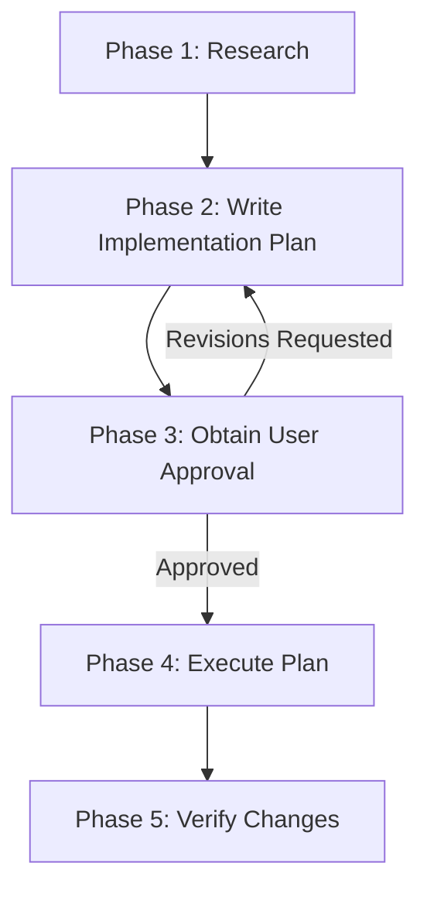

# Agent Implementation Planning Workflow

## Purpose

This skill defines the **mandatory planning workflow** for non-trivial changes across
software projects. It ensures complex work is researched, documented, user-approved, and
verified -- preventing wasted effort, uncoordinated subagents, and unintended breaking
changes.

> [!IMPORTANT]
> **Precedence Clause**: A project's own planning skill, `AGENTS.md`, or `CLAUDE.md`
> overrides this baseline wherever they differ. This skill provides the core methodology
> and baseline conventions for repositories that do not specify an overriding policy.

**Related skills**: `agent-subagent-guidelines` for the mandatory Subagent Use section.
Your harness's own skill for how it reconciles its plan mode or artifact directory with
`.plans/`.

---

## When a Plan Is Required

A written implementation plan is **required** when a task meets **any** of these criteria:

- It touches **more than one file**, component, or subsystem
- It crosses a **build or code regeneration boundary** (database migrations, parser
  generators, client SPA rebuilds, stylesheet compilers)
- It modifies public APIs, interfaces, interop contracts, or database schemas
- It is a refactor, architectural change, new feature, or anything described as
  non-trivial

A plan is **not** required for:

- Single-file bug fixes or localized tweaks
- Typo and comment corrections
- Answering questions or read-only investigation
- Minor follow-ups while executing an already-approved plan

**When in doubt, write a plan.** A rejected plan is cheap; wrong cross-system work is
expensive.

---

## The Five-Phase Lifecycle



### Phase 1 -- Research

- Use search and file-reading tools to understand affected code, dependencies, and
  implications.
- **Do NOT modify any files during this phase.** Read-only operations only.
- **Do NOT read documents from `.plans/`** (see `.plans/` Research Isolation).

### Phase 2 -- Write the Implementation Plan

- Create the plan as a Markdown file under `.plans/`.
- Address open questions and design decisions directly in the plan.
- If your harness confines you to a private plan file or artifact directory, copy the
  finished document to `.plans/` **before** requesting approval.

### Phase 3 -- Obtain User Approval

- **STOP and wait for explicit user approval before editing any project file.**
- Always print the plan's file path so the user can review it.
- Use the harness's approval mechanism where one exists; otherwise print a concise
  summary and wait. **Approval is never skipped.**

### Phase 4 -- Execute

- Implement step-by-step, tracking progress in `task.md`.
- If you discover something requiring significant deviation, pause, update the plan, and
  request approval for the revision before continuing.

### Phase 5 -- Verify

- Run tests, builds, and linters; complete the manual checks.
- Create `walkthrough.md` summarizing what changed, what was tested, and the results.

---

## Write for a Context-Free Implementer

**The person or agent implementing your plan may have none of your context, and may be a
different model in a different application.** Plans are handed between harnesses through
`.plans/`, and the implementing session cannot ask the planning session anything.

- No "as discussed above" across documents; no reliance on session history.
- Every file path absolute or repository-relative.
- Every decision stated, not implied. If you considered and rejected an approach, say so,
  or someone will re-propose it.
- Name the exact command, not "run the migration".

This is why plan quality is load-bearing: a well-specified plan makes most
implementation straightforward, and an underspecified one silently becomes guesswork.

---

## Plan Document Structure

```markdown
# [Goal Description]

Brief summary of the problem, background context, and objectives.

## User Review Required                          <- if applicable
Decisions the user must make (breaking changes, tradeoffs, data loss risk).

## Open Questions                                <- if applicable
Clarifying questions that impact implementation details.

## Execution Target                              <- optional
Planned in: <harness> (<tier>)
Intended implementer: <harness> (<tier>)

## Affected Files                                <- mandatory
| File | Component / Area | Change |
|------|------------------|--------|
| `path/to/FileA.cs` | Backend | Add method `DoThing()` |

## Build Impact                                  <- mandatory
Regeneration boundaries triggered (migrations, stylesheet compilation, client
build, code generation), or "None".

## Proposed Changes                              <- mandatory
Grouped by component, ordered by dependency (prerequisites first).
Mark each file [NEW], [MODIFY], or [DELETE].

## Subagent Use                                  <- mandatory
### Subagents Needed
[Yes / No -- if no, explain why]

### Subagent Assignments
| Task | Tier | Files | Rationale |

### Human Assignments (if any)
| Task | Rationale | Fallback if Not Approved |

## Risks                                         <- mandatory
What could break, edge cases, and mitigation strategies.

## Verification Plan                             <- mandatory
### Automated
- Test / build / linter commands.
### Manual
- Steps to verify functional correctness.
```

### The Execution Target line

Optional, but when the plan will be implemented in a different application than it was
written in, it calibrates everything else:

```markdown
## Execution Target
Planned in: Claude Code (deep)
Intended implementer: Antigravity (standard)
```

It names a **harness and a tier, never a model version** -- the planning session cannot
verify the implementing application's model roster, and **no agent can perform the
handoff**. A person opens the other application; the plan document is the entire
interface.

### Key structural rules

1. **Affected Files** -- every file the plan touches must be listed.
2. **Build Impact** -- explicitly state which regeneration steps must be re-run, or
   "None".
3. **Subagent Use** -- mandatory even when the answer is "No" (state why).
4. **Risks** -- do not skip. Even "low risk" changes should state what to watch for.
5. **Proposed Changes** -- order by dependency. Regeneration boundaries fall **between**
   steps, never inside one.

### Scaling the format

The full format applies to **non-trivial** work. If a harness asks for "concise" plans,
that means *no excessive verbosity within this format* -- keep every mandatory section
but keep each one tight. Never trim the Affected Files table.

For **truly trivial** work the harness's own concise format (or no plan) is acceptable.
Say in chat that the shortcut was taken because the task was trivial. If the user then
asks for the full format, produce it as the next revision.

---

## Where to Save Plans and Other Documents

All AI-produced documents -- implementation plans, reviews, analyses, bug reports, and
other structured artifacts -- are saved **inside the repository** under the gitignored
`.plans/` directory:

```text
.plans/
  YYYY-MM-DD/
    task_name/
      implementation_plan_v<N>.md       <- N=1 for the first version
      code_review_v<N>.md               <- example: a review document
      bug_analysis_v<N>.md              <- example: an analysis document
      task.md                           <- single file, from the approved plan
      walkthrough.md                    <- single file, post-completion summary
      implementation_review_A_v<N>.md   <- follow-up round A
      task_A.md                         <- follow-up A checklist
      walkthrough_A.md                  <- follow-up A walkthrough
```

### Directory naming

- **Date directory** (`YYYY-MM-DD`): the creation date of the **first** document for the
  task. Follow-ups on later dates reuse the same directory.
- **Task directory**: a short, descriptive `snake_case` name.
- **Create subdirectories** as needed -- they will not exist the first time.
- **Conflict resolution**: if the desired task directory already exists under the same
  date, find the next free name in the sequence `task_name`, `task_name_2`,
  `task_name_3`, ... Always increment from the **base** name; never nest suffixes
  (`task_name_2_3` is wrong). Never rename the existing folder, and do not read or modify
  it.

> [!IMPORTANT]
> **Three distinct suffix types -- do not confuse them:**
>
> | Suffix | Applies to | Meaning | Example |
> |--------|-----------|---------|---------|
> | `_2`, `_3`, ... | **Folder** names | Conflict resolution for separate tasks with the same name | `game_page_update_2/` |
> | `_A`, `_B`, ... | **File** names | Follow-up round within the same task folder | `implementation_review_A_v1.md` |
> | `_v1`, `_v2`, ... | **File** names | Document revision (never overwrite, always increment) | `implementation_plan_v2.md` |

### Document versioning (STRICT)

Applies to **all** document types in `.plans/`:

1. **First version** always gets `_v1`.
2. **Never overwrite an existing version.** To revise, create a new file with the next
   number (read `_v1` -> write `_v2`).
3. **Determine the next version** by checking which files already exist.
4. **Do not delete or modify** older versions. They are the revision history that lets a
   user compare approaches across different agents and sessions.

**Exception -- `task.md` and `walkthrough.md`** are **singular** (no version suffix),
based on whichever plan version was ultimately approved. The walkthrough must state which
plan version was implemented. Follow-up rounds get lettered variants (`task_A.md`,
`walkthrough_A.md`).

### How to write files

**Always use your native file-writing tool.** **Do NOT use shell commands** (`cat << EOF`,
`echo`, heredoc) -- Markdown contains backticks, dollar signs, and angle brackets that
cause shell quoting failures and corrupted output, and shell redirection produces the
wrong line endings.

---

## Harness Rules Take Precedence

Agent harnesses impose their own planning workflows, and some restrict where you may
write. **The harness rules always win.** This skill is guidance layered *inside* whatever
the harness permits.

### `.plans/` is the source of truth

A harness may keep its own private plan file or artifact directory. Treat that as a
**working copy**. The canonical document is always the one in
`.plans/YYYY-MM-DD/task_name/`.

This matters because agents hand work to each other. A different agent picking up the task
reads the **latest `_v<N>` from `.plans/`** and writes its next revision **to `.plans/`**
-- it never looks inside a harness-private directory it does not share.

### When to make the `.plans/` copy

**As soon as the plan is finished, and immediately before requesting approval.** The copy
is part of delivering the plan, not part of executing it.

Order: finish writing -> **copy to `.plans/`** -> print the path -> request approval.

> [!NOTE]
> **This copy does not violate a harness "no other file edits" restriction.** Such
> restrictions prevent the agent from changing the *project* before approval. Copying the
> plan to its canonical location touches no source file, build file, or data file.
> Everything else still waits: `task.md`, source edits, build steps.

### Versioning is per-location

| Location | Naming | Revising |
|----------|--------|----------|
| Harness-private plan file | Whatever the harness assigns | Edit **in place** |
| `.plans/` | `<document_name>_v<N>.md` | **Never overwrite** -- increment |

### Your harness's own mechanics

The exact reconciliation -- which private file or artifact directory your harness uses,
how approval is requested, and which research agents it prescribes -- is in your harness's
own skill, one of which is installed for you. Do not guess at another harness's mechanics.

---

## Progress Tracking

After approval, create `task.md` from the approved plan. Follow-up rounds get lettered
checklists (`task_A.md`).

```markdown
# Task Checklist

Based on: implementation_plan_v2.md

- [ ] Uncompleted task
- [/] In-progress task
- [x] Completed task
  - [x] Sub-task A
  - [ ] Sub-task B
```

Update it as you work through each step.

---

## Walkthrough Document

After completing all work, create `walkthrough.md` summarizing: which plan version was
implemented, what changed (with file references), what was tested, validation results,
and remaining follow-up items.

---

## Follow-Up Rounds

After execution and walkthrough, a task may need follow-up work -- reviews, corrections,
or supplementary changes. These are tracked as rounds within the same task directory.

### Naming

Each round gets a **letter suffix** (`_A`, `_B`, `_C`, ...) assigned sequentially,
embedded between the document name and the version:
`<document_name>_<round>_v<N>.md`. Check which letters exist before starting a new round.

| File type | Original | Follow-up A | Follow-up B |
|-----------|----------|-------------|-------------|
| Plan / review / analysis | `implementation_plan_v1.md` | `implementation_review_A_v1.md` | `performance_analysis_B_v1.md` |
| Task checklist | `task.md` | `task_A.md` | `task_B.md` |
| Walkthrough | `walkthrough.md` | `walkthrough_A.md` | `walkthrough_B.md` |

- The **document name** describes the content, in `snake_case`.
- The **round letter** identifies which follow-up round it belongs to.
- The **version suffix** tracks revisions within the round, following the same strict
  rules.
- Checklists and walkthroughs are **singular per round** -- no version suffix.

### Lifecycle and scope

Each round follows the **same five-phase lifecycle**, and its plan requires user approval
before execution.

- Use a **follow-up round** when the work directly relates to the original task.
- Create a **new task** when the work is substantially independent, the scope has grown
  beyond the original, or enough time has passed.

---

## Quick Decision Guide

```text
Is it a minor follow-up while executing an already-approved plan?
  -> YES: Skip a new plan. Continue executing the existing one.
  -> NO: Continue

Is the task trivial (single file, typo, comment, question)?
  -> YES: Skip the plan. Just do it.
  -> NO: Continue

Does it touch multiple files, cross subsystem boundaries, or change a contract?
  -> YES: Write a full plan. Follow the five-phase lifecycle.
  -> NO: Use judgment. When in doubt, write the plan.
```

---

## `.plans/` Isolation During Research

The `.plans/` directory accumulates plans, analyses, and reviews from past and current
tasks -- including **superseded drafts** (`_v1` when `_v2` was approved), **rejected
approaches**, and **stale analyses** whose assumptions no longer hold.

> [!CAUTION]
> **Do NOT browse or read `.plans/` during Phase 1 (Research).** Old plan content corrupts
> research by injecting outdated design decisions and rejected approaches into your
> analysis. Base research exclusively on the **actual source code, project files, tests,
> and skill documentation** -- these are the ground truth.

### Rules for orchestrating agents

| Situation | Rule |
|-----------|------|
| **Phase 1 -- Research** | Do NOT read any file under `.plans/`. Research the actual codebase. |
| **Phase 2 -- Writing a plan** | Do NOT read other tasks' plans. You may read your own task's prior versions if the user asked you to revise. |
| **Phase 4 -- Execution** | Read **only** the approved plan for the current task. |
| **Follow-up rounds** | You may read the walkthrough and plan from the **same task directory**. |
| **Picking up another agent's work** | Read the **latest `_v<N>`** for the specific task you are continuing. |

### Rules for subagents

Subagents operate on a **strict need-to-know basis**:

- **Do NOT read any file in `.plans/`** unless the orchestrator gives a specific path and
  instructs you to read it.
- The orchestrator passes relevant context **in the subagent's prompt**, not by pointing
  it at the directory.

### Rationale

1. **Stale data corruption** -- a `_v1` plan may contain an approach that was explicitly
   rejected. An agent reading it may unconsciously adopt the rejected design.
2. **Cross-task contamination** -- plans for unrelated tasks may describe changes to the
   same files with different intent.
3. **Token waste** -- `.plans/` grows large; reading irrelevant plans spends context that
   should go to source code.
4. **Subagent scope creep** -- subagents that browse `.plans/` discover context beyond
   their assignment, leading to out-of-scope changes.
