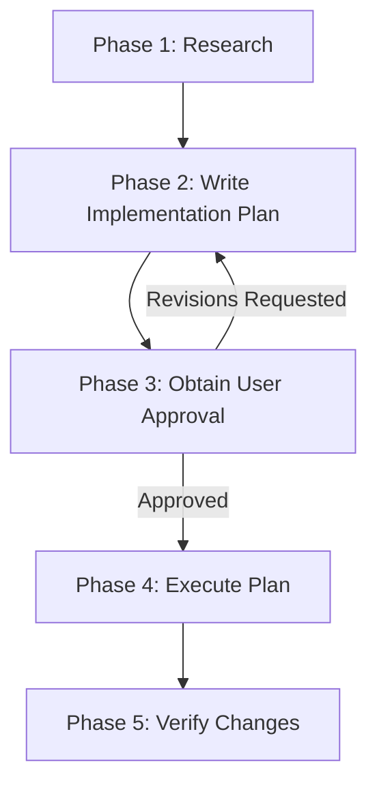

# Agent Implementation Planning Workflow

## Purpose

This skill defines the **mandatory planning workflow** for non-trivial changes across software projects. It ensures that complex work is researched, documented, user-approved, and verified — preventing wasted effort, uncoordinated subagents, and unintended breaking changes.

> [!IMPORTANT]
> **Precedence Clause**: A project's own planning skill, `AGENTS.md`, or `CLAUDE.md` overrides this baseline wherever they differ. This skill provides the core methodology and baseline conventions for repositories that do not specify an overriding policy.

---

## When a Plan Is Required

A written implementation plan is **required** when a task meets **any** of these criteria:

- It touches **more than one file**, component, or subsystem
- It crosses a **build or code regeneration boundary** (e.g. database migrations, parser generators, client SPA rebuilds, stylesheet compilers)
- It modifies public APIs, interfaces, interop contracts, or database schemas
- It is a refactor, architectural change, new feature, or anything described as non-trivial

A plan is **not** required for:
- Single-file bug fixes or localized tweaks
- Typo and comment corrections
- Answering questions or read-only investigation
- Minor follow-ups while executing an already-approved plan

**When in doubt, write a plan.** A rejected plan is cheap; wrong cross-system work is expensive.

---

## The Five-Phase Lifecycle

Every planned task follows these phases in strict order:



### Phase 1 — Research
- Use search and file-reading tools to understand affected code, dependencies, and implications.
- **Do NOT modify any files during this phase.** Read-only operations only.
- **Do NOT read documents from `.plans/` during research** (see `.plans/` Research Isolation).
- Gather notes to formulate your approach.

### Phase 2 — Write the Implementation Plan
- Create the plan as a Markdown file saved under `.plans/` (or the harness artifact location).
- Address any open questions or design decisions directly in the plan.
- If the harness confines you to a private plan file or artifact directory, copy the finished document to `.plans/` **before** requesting user approval.

### Phase 3 — Obtain User Approval
- **STOP and wait for explicit user approval before editing any project files.**
- Always print the plan's file path in chat so the user can review it.
- Use the harness's approval mechanism (e.g. `ExitPlanMode` in Claude Code, or review prompts in Antigravity) or print a concise summary and wait. **Approval is never skipped.**

### Phase 4 — Execute
- Implement the plan step-by-step.
- Track progress using a task checklist (`task.md`).
- If you discover issues that require significant deviation from the approved plan, pause, update the plan, and request approval for the revision before continuing.

### Phase 5 — Verify
- Run automated tests, builds, and linters.
- Complete any required manual checks.
- Create a `walkthrough.md` document summarizing what was changed, what was tested, and the verification results.

---

## Plan Document Structure

Use this standard template for non-trivial tasks:

```markdown
# [Goal Description]

Brief summary of the problem, background context, and objectives.

## User Review Required                          ← if applicable
Decisions the user must make (breaking changes, tradeoffs, data loss risk).

## Open Questions                                ← if applicable
Clarifying questions that impact implementation details.

## Affected Files                                ← mandatory
| File | Component / Area | Change |
|------|------------------|--------|
| `path/to/FileA.cs` | Backend | Add method `DoThing()` |
| `path/to/FileB.ts` | Frontend | Update interface |

## Build Impact                                  ← mandatory
Regeneration boundaries triggered (e.g. migrations, SCSS, client build, code generation), or "None".

## Proposed Changes                              ← mandatory
Grouped by component, ordered by dependency (prerequisites first).
Mark each file `[NEW]`, `[MODIFY]`, or `[DELETE]`.

## Subagent Use                                  ← mandatory
### Subagents Needed
[Yes / No — if no, explain why]

### Subagent Assignments
| Task | Model Tier | Files | Rationale |
|------|------------|-------|-----------|

### Human Assignments (if any)
| Task | Rationale | Fallback if Not Approved |
|------|-----------|--------------------------|

## Risks & Mitigations                           ← mandatory
What could break, edge cases, and mitigation strategies.

## Verification Plan                             ← mandatory
### Automated
- Test / build / linter commands.

### Manual Verification
- Steps to verify functional correctness.
```

---

## Subagent Use Guidelines

Every plan **must** include a Subagent Use section, even if no subagents are needed.

### Model Tier Selection
- **`inherit` (default)**: Use the orchestrator's full reasoning tier for almost all subagent tasks (complex refactoring, multi-file edits, design, deep debugging).
- **`flash` / `haiku` (cheapest tier)**: Reserved strictly for zero-judgment mechanical tasks (e.g. applying identical string replacements across multiple files). Any ambiguity or context-sensitivity requires `inherit`.

### Agent Types & Roles
- **Research / Explore**: Read-only investigation and codebase survey (cannot edit files).
- **Plan**: Design formulation from gathered data (cannot edit files).
- **Coder / General-Purpose**: Execution and editing approved files.

### Coordination Constraints
- **File-Level Exclusivity**: No two agents may edit the same file concurrently. Sequence tasks if they share files.
- **Respect Regeneration Boundaries**: Do not parallelize across build/compilation boundaries where output from one step is needed as input for the next.
- **Never Overwrite Uncommitted Changes**: Ask the user to commit or explicitly approve before replacing or reverting existing files.
- **Human Task Assignments**: Human assignments are the rare exception, reserved for very large cut-and-paste moves (50+ lines) where AI failure risk is high. Small edits must be done by the agent.

---

## Document Storage and Versioning in `.plans/`

All planning documents, reviews, analyses, and walkthroughs are stored under the gitignored `.plans/` folder:

```text
.plans/
  YYYY-MM-DD/
    task_name/
      implementation_plan_v<N>.md       ← N=1 for first version
      task.md                           ← single active checklist
      walkthrough.md                    ← post-completion summary
      implementation_review_A_v<N>.md   ← follow-up round A
      task_A.md                         ← follow-up round A checklist
      walkthrough_A.md                  ← follow-up round A walkthrough
```

### Directory Naming & Conflict Resolution
- **Date directory (`YYYY-MM-DD`)**: Creation date of the first document in the task.
- **Task directory**: Short, descriptive `snake_case` name.
- **Conflict resolution**: If `task_name` already exists on the same date, increment to `task_name_2`, `task_name_3`, etc. Always increment from the base name; never nest suffixes.

### Versioning Rules (STRICT)
- First version is always `_v1`.
- **Never overwrite an existing version.** Increment to `_v2`, `_v3`, etc. when creating revisions.
- `task.md` and `walkthrough.md` are singular per task round (no `_v<N>` suffix).

---

## Harness Rules Take Precedence

### `.plans/` Is the Source of Truth
Harness-private plan files (e.g. Claude Code `~/.claude/plans/<slug>.md` or Antigravity artifact folders) are working/backup copies. The canonical artifact must be copied to `.plans/YYYY-MM-DD/task_name/` before requesting approval.

### Harness Specifics

#### Claude Code
- Write to `~/.claude/plans/<slug>.md`.
- Copy to `.plans/YYYY-MM-DD/task_name/implementation_plan_v<N>.md` before calling `ExitPlanMode`.
- Use native `Write` / `Edit` tools.

#### Antigravity / Gemini
- Create the implementation plan in the artifact directory (`<appDataDir>/brain/<conversation-id>/implementation_plan.md`).
- Also copy to `.plans/YYYY-MM-DD/task_name/implementation_plan_v<N>.md`.
- Present the plan artifact and wait for user approval.

---

## `.plans/` Research Isolation

> [!CAUTION]
> **Do NOT browse or read `.plans/` during Phase 1 (Research).** Past plans may contain rejected approaches, outdated assumptions, or superseded designs. Base research exclusively on ground-truth source code, project files, and tests.
>
> Subagents must not browse `.plans/` unless explicitly given a specific file path by the orchestrator.
